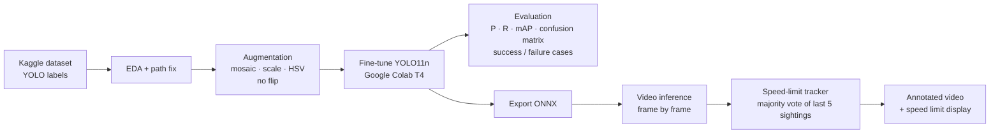

# Traffic Sign Detection & Speed Limit Identification

SDAIA Academy · Computer Vision Systems Development · Final Project

## Project Overview
A computer vision system that detects traffic signs in road images and driving videos and tells the
driver the **current speed limit**, similar to the Traffic Sign Recognition feature in modern cars.
A YOLO11 object detector is fine-tuned on a public traffic-sign dataset, evaluated on a held-out test
set, exported to ONNX, and demonstrated on a real driving video.

## Problem Description
Drivers often miss speed-limit signs, especially at night, in heavy traffic or on unfamiliar roads —
a common cause of speeding tickets and accidents. The goal is a system that:

- **Input:** a road image or a dash-cam / phone driving video
- **Output:** bounding boxes and class labels for each sign (speed limits 10–120, stop, traffic lights)
  plus a stable on-screen display of the current speed limit

## Dataset & Model Used
**Dataset:** [Traffic Sign Detection Dataset — Kaggle (icebearogo)](https://www.kaggle.com/datasets/icebearogo/traffic-sign-detection-dataset),
already annotated in YOLO format with train / valid / test splits.
Classes: Green Light, Red Light, Stop and Speed Limit 10, 20, 30, … 120.
Class balance and box-size statistics are shown in the training notebook.

**Model:** YOLO11n (Ultralytics), pretrained on COCO and fine-tuned on this dataset (transfer learning).
The nano version was chosen so the model can run in real time on a CPU.

**Preprocessing & augmentation:** letterbox resize to 640×640, normalisation, mosaic, random
scale/translate, HSV colour jitter. Horizontal flip is **disabled** because mirrored digits are not valid signs.

## Workflow / Architecture


## Results & Evaluation
> Filled in after training — numbers come from `results/eval_report.md`.

| Metric (test set) | Value |
|---|---|
| Precision | _TBD_ |
| Recall | _TBD_ |
| mAP@0.5 | _TBD_ |
| mAP@0.5:0.95 | _TBD_ |

| Format | Size | mAP@0.5 | CPU ms/img |
|---|---|---|---|
| PyTorch `.pt` | _TBD_ | _TBD_ | _TBD_ |
| ONNX `.onnx` | _TBD_ | _TBD_ | _TBD_ |

Training curves, confusion matrix and PR curve: `results/`.

**Success cases:** `results/success_cases.png` · **Failure cases:** `results/failure_cases.png`

**Video demo:** `results/*_stats.png`, `results/*_frames.png` (annotated video link: _TBD_)

## Technologies Used
Python · Ultralytics YOLO11 · PyTorch · OpenCV · ONNX / ONNX Runtime · pandas · matplotlib ·
Google Colab (GPU training) · Kaggle (dataset) · Jupyter

## How to Run the Project
**1. Train & evaluate (Google Colab)**
1. Open `notebooks/01_train_evaluate.ipynb` in Colab (File → Upload notebook, or open from GitHub).
2. Runtime → Change runtime type → **T4 GPU**, then Runtime → Run all.
3. At the end a zip downloads: put `best.pt` / `best.onnx` in `weights/` and the `results/` files in `results/`.

**2. Test on a driving video (local)**
```bash
python3 -m venv .venv
```
```bash
.venv/bin/pip install -r requirements.txt
```
```bash
.venv/bin/jupyter notebook notebooks/02_video_test.ipynb
```
Put your video in `videos/`, set `VIDEO_PATH` in the first cell, then run all cells.
The annotated video is saved in `results/`.

## Future Improvements
- Higher input resolution or a second-stage digit classifier to separate look-alike limits (30/80, 50/60)
- Larger model (YOLO11s/m) for small, distant signs
- More data for rare classes and for Saudi road signs, night and rain conditions
- Object tracking (e.g. ByteTrack) to link detections of the same sign across frames
- INT8 quantisation for embedded devices (Raspberry Pi, Jetson)

## SDAIA Academy GitHub Repository Link
https://github.com/majtob/computer_vision_SDAIA
