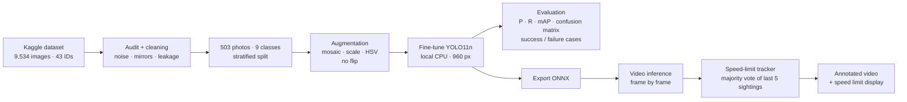

# Traffic Sign Detection & Speed Limit Identification

SDAIA Academy · Computer Vision Systems Development · Final Project

## Project Overview
A computer vision system that detects traffic signs in road images and driving videos and tells the
driver the **current speed limit**, similar to the Traffic Sign Recognition feature in modern cars.
A YOLO11 object detector is fine-tuned on a public traffic-sign dataset, evaluated on a held-out test
set, exported to ONNX, and demonstrated on a real driving video.

## Problem Description
Drivers often miss speed-limit signs, especially at night, in heavy traffic or on unfamiliar roads —
a common cause of speeding tickets and accidents. The goal is a system that:

- **Input:** a road image or a dash-cam / phone driving video
- **Output:** bounding boxes and class labels for each sign (speed limits 10–120, stop, traffic lights)
  plus a stable on-screen display of the current speed limit

## Dataset & Model Used
**Dataset:** [Traffic Sign Detection Dataset — Kaggle (icebearogo)](https://www.kaggle.com/datasets/icebearogo/traffic-sign-detection-dataset):
9,534 road images with YOLO-format labels and 43 class IDs but **no class-name file**. By cropping examples of
every class we identified the IDs as the German traffic sign standard (GTSRB: 0 = 20 km/h, 1 = 30 km/h, … 14 = Stop).

**Data audit — three problems found and fixed** (evidence in the training notebook):

| Problem | Evidence | Fix |
|---|---|---|
| Label noise | 68 % of images label *every* sign as class 0 | Drop images with only class-0 labels |
| Mirrored copies | Each photo appears up to 6×; 54 % of copies are horizontally flipped (mirrored digits, left/right arrows swapped) | Keep original photos only |
| Train/val leakage | 100 % of validation photos also appear in train | New split by photo |

**Prepared dataset:** 503 clean 1360×800 photos, split 70/15/15 (stratified so every speed limit is in val and test),
re-mapped to **9 classes** focused on the goal: Speed Limit 30, 50, 60, 70, 80, 100, 120, Stop, Other Sign.

**Model:** YOLO11n (Ultralytics), pretrained on COCO and fine-tuned on this dataset (transfer learning).
The nano version trains on a laptop CPU and runs in real time.

**Preprocessing & augmentation:** letterbox resize to 960×960 (signs are only ~37 px wide in the original photos),
normalisation, mosaic, random scale/translate, HSV colour jitter. Horizontal flip is **disabled** because
mirrored digits are not valid signs.

## Workflow / Architecture


## Results & Evaluation
> Filled in after training — numbers come from `results/eval_report.md`.

| Metric (test set) | Value |
|---|---|
| Precision | _TBD_ |
| Recall | _TBD_ |
| mAP@0.5 | _TBD_ |
| mAP@0.5:0.95 | _TBD_ |

| Format | Size | mAP@0.5 | CPU ms/img |
|---|---|---|---|
| PyTorch `.pt` | _TBD_ | _TBD_ | _TBD_ |
| ONNX `.onnx` | _TBD_ | _TBD_ | _TBD_ |

Training curves, confusion matrix and PR curve: `results/`.

**Success cases:** `results/success_cases.png` · **Failure cases:** `results/failure_cases.png`

**Video demo:** `results/*_stats.png`, `results/*_frames.png` (annotated video link: _TBD_)

## Technologies Used
Python · Ultralytics YOLO11 · PyTorch · OpenCV · ONNX / ONNX Runtime · pandas · matplotlib ·
kagglehub · Jupyter

## How to Run the Project
Everything runs locally on CPU (tested on an Intel i7 MacBook Pro).

**1. Install**
```bash
python3 -m venv .venv
```
```bash
.venv/bin/pip install -r requirements.txt
```

**2. Train & evaluate** — `notebooks/01_train_evaluate.ipynb`
```bash
caffeinate -i .venv/bin/jupyter notebook notebooks/01_train_evaluate.ipynb
```
Run all cells. It downloads the dataset (3.5 GB), cleans it, trains (~7 min/epoch at 960 px, so leave it
overnight; re-running resumes if interrupted), writes the evaluation report to `results/` and the
weights (`best.pt`, `best.onnx`) to `weights/`.

**3. Test on a driving video** — `notebooks/02_video_test.ipynb`

Put your video in `videos/`, set `VIDEO_PATH` and the `SEGMENTS` to test (start/end times) in the first cell,
then run all cells. Each segment is saved as an annotated video in `results/video/`, with a summary table
(`video_summary.md`) and charts.

## Future Improvements
- Higher input resolution or a second-stage digit classifier to separate look-alike limits (30/80, 50/60)
- Larger model (YOLO11s/m) for small, distant signs
- More data: re-label the 4K subset where every sign is "class 0", add Saudi road signs, night and rain
- Train on a GPU to use a larger model and more epochs
- Object tracking (e.g. ByteTrack) to link detections of the same sign across frames
- INT8 quantisation for embedded devices (Raspberry Pi, Jetson)

## SDAIA Academy GitHub Repository Link
https://github.com/SDAIAAcademy
